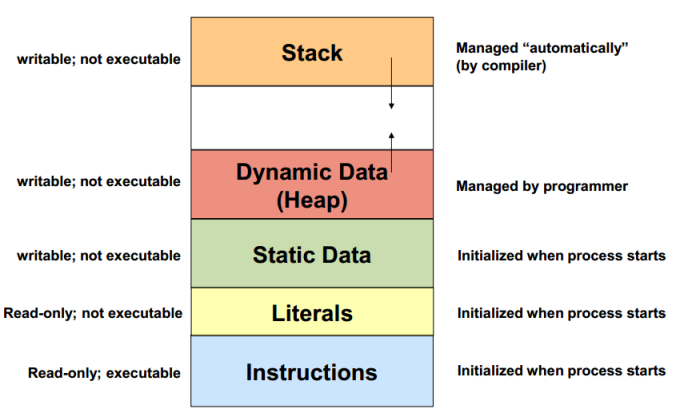

# ACTIVIDAD 01

```C++
class Particle {
public:
    float x, y;
    void move(float dx, float dy) {
        x += dx;
        y += dy;
    }
};
```

- ¿Qué representa la clase Particle?

RTA: Representa la posición en X y en Y de una partícula.

- ¿Cómo interactúan sus atributos y métodos?

RTA: En este caso, los atributos sirven para brindarle valores de posición inicial a la partícula y cuando se llama a la función move, se le puede modificar estas posiciones a la partícula para moverla a diferentes partes de la pantalla.

- ¿Los atributos están almacenados de forma contigua?

RTA: Sí...


- ¿Qué indica el tamaño del objeto sobre su estructura interna?

RTA: El tamaño del objeto corresponde al tamaño de los atributos ya que los métodos están guardados e otra parte de la memoria RAM.

- Cómo afectan los datos estáticos al tamaño de la instancia?

RTA: De modo que cuando se crea un objeto estático este no se muestra en el stack ya que se almacena en la zona de la memoria RAM que está destinada específicamente a los objetos estáticos.

- ¿Qué diferencias hay entre datos estáticos y dinámicos en términos de memoria?

RTA: Que los estáticos, aunque no es necesario instanciarlos para que se puedan usar, apenas se deja de depurar la aplicación se borran de manera automática, mientras que los dinámicos es necesarios borrarlos de forma manual.

### Reflexión

Documenta en tu bitácora de aprendizaje:

- ¿Qué es un objeto desde la perspectiva de la memoria?

RTA: Un conjunto de atributos y métodos cuyos atributos se reservan en la memoria RAM con un espacio de ocupación de 4 bytes cada uno, mientras que los métodos se reservan en otra parte de la memoria destinada a las instrucciones y el texto.

- ¿Cómo influyen los atributos y métodos en el tamaño y estructura del objeto?

RTA: Dependiendo de la cantidad de atributos y métodos, la memoria ocupada por cada clase aumenta o disminuye y además, abarca un espacio determinado en cada zona de las zonas que hay en la RAM dependiendo del tipo de dato que haya en sí.

- Conclusión: resumir los hallazgos y cómo esto impacta el diseño de clases.

RTA:

a. Los datos del stack se reservan ahí y se tienen que instanciar para que sigan existiendo, además, se eliminan apenas se deja de depurar la aplicación.

b. Los datos que se guardan en el heap se tienen que eliminar manualmente o de lo contrario, se quedan en la memoria dinámica hasta que sean borrados, lo cual puede generar errores de rendimiento en el programa.

c. Los métodos no se guardan en el stack, se guardan en otra zona de la memoria dedicada a las instrucciones y el texto.

d. Los atributos estáticos tampoco se guardan en el stack, se ubican en una zona de la memoira específicamente de objetos estáticos, por esto su espacio no está ubicado en el heap. Estos datos no es necesario instanciarlos para que se puedan utilizar más sin embargo, se eliminan automáticamente cuando se deja de correr un código...





