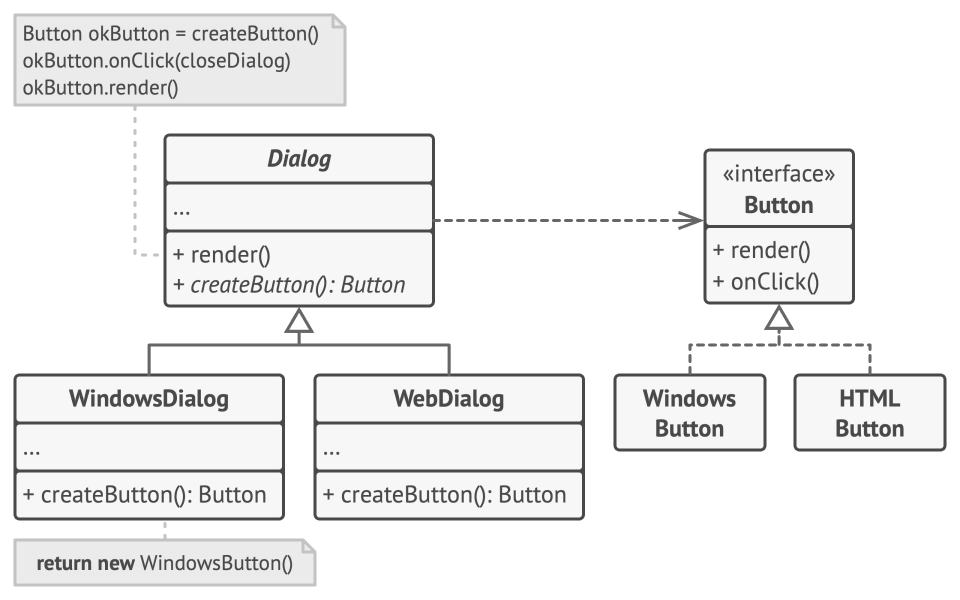
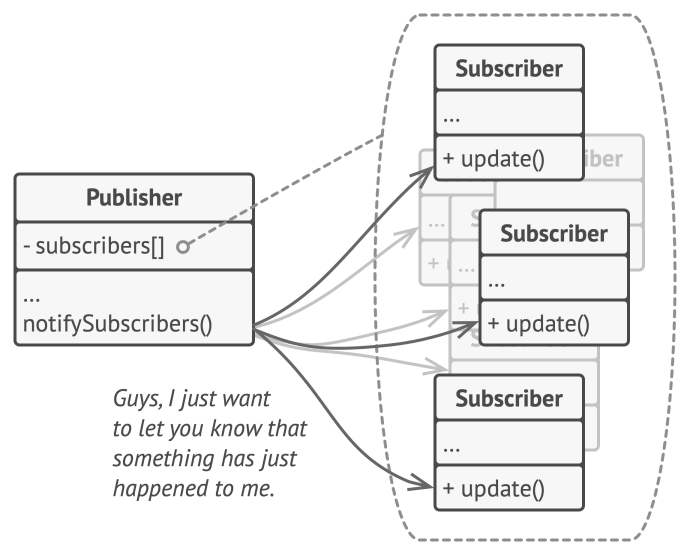
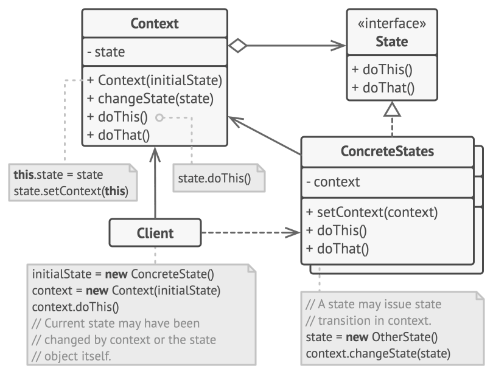

# ACTIVIDAD 01

## **Introducción**

En esta unidad exploraremos algunos patrones de diseño (**Observer**, **Factory** y **State**). Estos patrones son soluciones comprobadas a problemas comunes en el diseño de software orientado a objetos. Aplicarás estos patrones al desarrollo de un proyecto de arte generativo interactivo en tiempo real utilizando **C++** y **openFrameworks**. Además, enfatizaremos la importancia de realizar pruebas desde el inicio del desarrollo para garantizar el correcto funcionamiento de las aplicaciones.

### Sesión 1: profundización teórica de patrones de diseño

- **Método de las Fábricas:** El método de las fábricas funciona de tal manera que primero, se crea una clase padre que posee ciertos atributos y métodos. De estos, va a haber un método que se va a encargar exclusivamente de crear una instancia, la cual vamos a llamar interfaz, la cual es una clase que simplemente se crea como "Plantilla" para luego generar otras clases que van a heredar sus métodos. Volviendo a la clase padre, de esta se van a heredar unos constructores que por herencia, van a heredar sus métodos y atributos. Estos constructores sirven para instanciar objetos que van a estar correlacionados y que se van a desprender de la interfaz generada previamente, lo que va a permitir que aunque estos tengan sus mismos métodos pero que al tener atributos diferentes por las "clases hijas" que se generaron a partir de la clase padre, tengan un comportamiento diferente.
Este método es muy útil cuando se va a crear un proyecto en el que no se tiene certeza de los objetos que se van a requerir pero se tiene una base con la que estos van a funcionar y además, este método sirve para separar el código de construcción de un producto del código que usa el producto, lo que hace que sea más fácil extender el código de construcción del producto de manera independiente.

**IMÁGEN DE RESPALDO:**

- **Método del Observador:** Este método sirve para que, en caso de que se tenga que notificar a alguna de las clases del algoritmo que ocurrió un evento, para que estos objetos puedan ejecutar una acción. Esto sirve para que en caso de que algunas de las clases no requieran de ser notificadas, solo las clases que fueron inscritas en la clase "notificadora" reciban que el evento que estaban esperando ya ha ocurrido. Esto sirve para dar orden a la estructura del código y de paso, para no tener código extra regado en la plantilla del mismo.

**IMÁGEN DE RESPALDO:**

- **Método de la máquina de clases:** El método de la máquina de clases consiste en que a lo largo del código, se van a presentar varios estados, los cuales funcionan como "punto de actualización" del momento en que se encuentra la ejecución del código. Para que se pase de un estado a otro, es necesario que transcurran ciertos "eventos", los cuales son situaciones esperadas y que dependiendo de cuando estas ocurran, se ejecuta una acción determinada y se cambia de estado. Este método permite llevar a cabo un sistema funcional y bien estructurado que ayuda a que se pueda llevar margen de cada momento de la depuración del código, lo cual ayuda a determinar errores con mayor precisión y más notoriedad, ya que si la secuencia de estados se detiene en cierto punto determinado, y ase puede tener un punto de partida por el cual empezar a buscar errores.

**IMÁGEN DE RESPALDO:**

